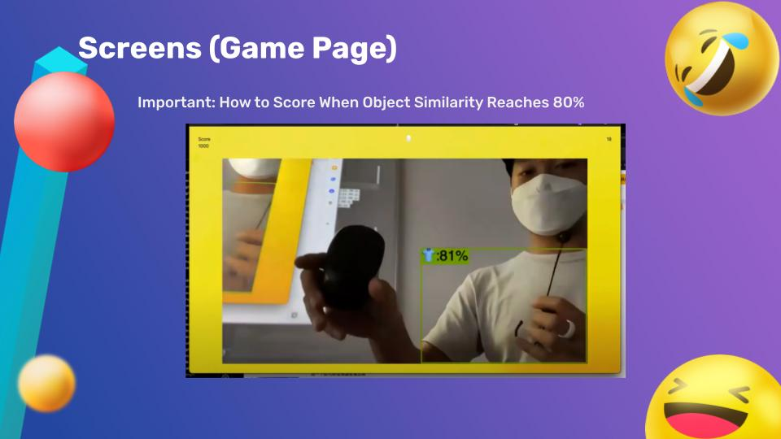

# Emoji Mama

## Introduction
Welcome to Emoji Mama, an A.I. experiment that merges fun and technology into a single mini-game experience! Powered by advanced machine learning, Emoji Mama challenges players to find emojis in the real world using their device's camera. It's an engaging way to see artificial intelligence in action, inspired by concepts from Google's Emoji Scavenger Hunt.

## How It Works
Emoji Mama uses your phone or laptop camera to identify and locate emojis in your environment. When an emoji is displayed on the screen, it's your job to scan your surroundings and help the AI find the real-world counterpart. The faster you find it, the higher your score!

## Technical Stack
Our game is built on a robust stack of modern technologies:
- Frontend: Javascript, Typescript
- Backend: Node.js, Express.js
- AI & Machine Learning: Python, YOLOv5
- Testing: Playwright
- Database: PostgreSQL
- Hosting: AWS EC2
- Storage: AWS S3

## Getting Started
To get started with Emoji Mama:
1. Clone the repository to your local machine.
2. Install the required dependencies.
3. Set up your local environment with the necessary API keys and database configurations.
4. Run the application and open your browser to the designated port.

## Acknowledgments
A special thanks to Google for inspiring this project. Check out the original Emoji Scavenger Hunt by Google [here](https://emojiscavengerhunt.withgoogle.com/).

## Screenshots

## Demo Video

## Overview

